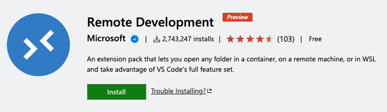
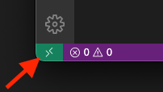
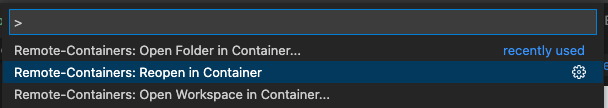
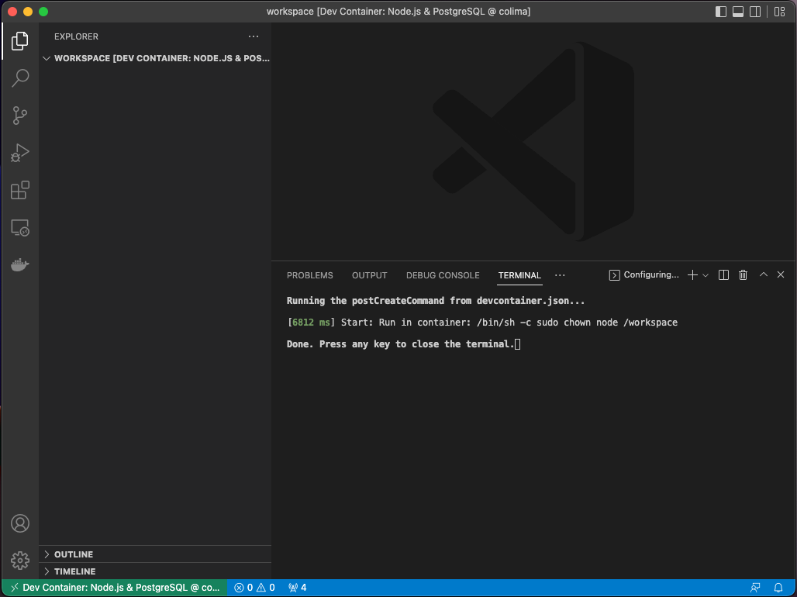
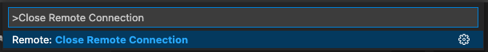

# Backstage Workshop

This repository helps candidates with initial setup of the development environment. Additionally, it provides some example entities, code samples that will be used in the workshop.

# Laptop Setup

## 1. Install Visual Studio Code
Use [link](https://code.visualstudio.com/download) to download the installer for Visual Studio Code.

> **Note**
>
> We are using Visual Studio Code Version: 1.69.2 (Universal) for this workshop.

## 2. Install docker command line tools and Colima
### 2.1. Install Colima
Run following command to install Colima on MacOs using `brew` package manager.
```sh
brew install colima
```

### 2.2 Install docker and docker-compose
Run follwing command to install Docker tools on MacOs using `brew` package manager.
```sh
brew install docker docker-compose
```

Optionally, configure docker-compose as a Docker plugin to use `docker compose` as a command.
```sh
mkdir -p ~/.docker/cli-plugins
ln -sfn $(brew --prefix)/opt/docker-compose/bin/docker-compose ~/.docker/cli-plugins/docker-compose
```

> **Note**
>
> We are using Colima version: 0.4.4 for this workshop.

## 3. Install Remote-Containers extension for Visual Studio Code.

The Remote - Containers extension lets you run Visual Studio Code inside a Docker container.

> [Install the Remote - Development extension](vscode:extension/ms-vscode-remote.vscode-remote-extensionpack)



Upon successful installation, you will see a new Status bar item at the far left.


> **Information**
>
> For more information on VS Code Remote Development, read [this article](https://code.visualstudio.com/docs/remote/remote-overview).

# Opening workspace in the dev-container

## 1. Start Docker Desktop
Run following commands from terminal to start the colima.
```sh
colima start --cpu 2 --memory 4
```
>**Note**
>This may take few minutes for the first run.

## 2. Open VS Code in Container
1. Clone this repository and open it in VS code.
2. Open command pallate and select `Remote-Container: Reopen in Container`. 


Upon successful container creation, you should see the workspace opened in the VS code as shown in the image below.


>**Note**
>This may take few minutes for the first run to build the container.

>**Information**
>Workspace folder is on container local volume.
>The repository on the host machine is mapped to `/my-machine`.

## 3. Close Container
1. Open command pallate and select `Remote: Close Remote Connection`. 

>**Note**
>You should push your code before closing the container as the workspace is local volume (not mapped on the host machine).

2. Stop colima by running following command from terminal.
```sh
colima stop
``` 
