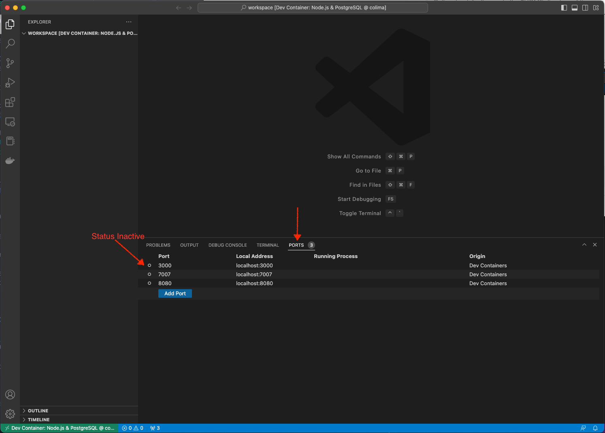

# Backstage Workshop

This repository helps candidates with initial setup of the development environment. Additionally, it provides some example entities, code samples that will be used in the workshop.

**Contents**
- **[Workshop requirements](#workshop-requirements)**
- **[Laptop setup](#laptop-setup)**
- **[Opening workspace in the dev-container](#opening-workspace-in-the-dev-container)**
- **[Description of resources](#description-of-resources)**

---

## Workshop requirements

In addition to the [laptop setup](#laptop-setup)
- You will need a GitHub account.
- During the workshop you would need to free up following ports as they are required by the Backstage applications to run.
  - 3000
  - 7000
  - 8080   

### Optional (things to learn before the workshop):
- You can learn the [YAML](https://yaml.org/) file syntax as it will come handy while changing the entities and backstage configuration.
- Since, backstage is written using [React](https://reactjs.org/), [Node](https://nodejs.org/en/) and, [Typescript](https://www.typescriptlang.org/), some basic knowledge of these would be helpful.

---

## Laptop setup

> **Note**
> We will be using a [Dev container](https://code.visualstudio.com/docs/remote/containers) in this workshop.
>
> The only motivation behind this is to provide a standard development evironment with all tools and utilities pre-installed. This provides an ephemeral  environment for development during the workshop. Hence, the setup for workshop will not interfere with candidates local development environment.

### 1. Install Visual Studio Code
Use [link](https://code.visualstudio.com/download) to download the installer for Visual Studio Code.

> **Note**
>
> We are using Visual Studio Code Version: 1.75.0 (Universal) for this workshop.

### 2. Install docker command line tools and Colima
#### 2.1. Install Colima
Run following command to install Colima on MacOs using `brew` package manager.
```sh
brew install colima
```

#### 2.2 Install docker and docker-compose
Run follwing command to install Docker tools on MacOs using `brew` package manager.
```sh
brew install docker docker-compose
```

Optionally, configure docker-compose as a Docker plugin to use `docker compose` as a command.
```sh
mkdir -p ~/.docker/cli-plugins
ln -sfn $(brew --prefix)/opt/docker-compose/bin/docker-compose ~/.docker/cli-plugins/docker-compose
```

> **Note**
>
> We are using Colima version: 0.5.2 for this workshop.

> **Note**
>
> Instead of Colima, you can also use minikube as an replacement for docker desktop. Refer to this [article](https://minikube.sigs.k8s.io/docs/tutorials/docker_desktop_replacement/) for more information.


#### 3. Install Remote-Containers extension for Visual Studio Code.

The Remote - Containers extension lets you run Visual Studio Code inside a Docker container.

[Install the Remote - Development extension](vscode:extension/ms-vscode-remote.vscode-remote-extensionpack)


Upon successful installation, you will see a new Status bar item at the far left.


> **Information**
>
> For more information on VS Code Remote Development, read [this article](https://code.visualstudio.com/docs/remote/remote-overview).

---

## Opening workspace in the dev-container

### 1. Start Docker Desktop
Run following commands from terminal to start the colima.
```sh
colima start --cpu 4 --memory 8
```
>**Note**
>
>This may take few minutes for the first run.

### 2. Open VS Code in Container
1. Clone this repository and open it in VS code.
2. Open command pallate and select `Remote-Container: Reopen in Container`. 


Upon successful container creation, you should see the workspace opened in the VS code as shown in the image below.


Click on the PORTS tab to see the ports exposed from the container.
You should see the list of the ports as shown below.


Run following command from terminal to see the status of the devcontainers.
```shell
docker ps
```

You should see output similar to one shown below.


>**Note**
>
>This may take few minutes for the first run to build the container.

>**Information**
>
>Workspace folder is on container local volume.
>The repository on the host machine is mapped to `/my-machine`.
>
>Colima by default mounts the $HOME directory of the user on the container. In order to use the mapping mentioned above, clone this repository anywhere under your $HOME directory. `/my-machine` will not be accessible if this project is cloned outside $HOME.

#### Now, you are all set for the workshop!
You can close the container now by following step [3](#3.-close-container).
On the workshop day, just open the dev container following steps [1](#1.-start-docker-desktop) & [2](#2.-open-vs-code-in-container).

### 3. Close Container
1. Open command pallate and select `Remote: Close Remote Connection`. 

>**Note**
>
>You should push your code before closing the container as the workspace is local volume (not mapped on the host machine).

2. Stop colima by running following command from terminal.
```sh
colima stop
``` 

---

## Description of resources:
| Directory | Description |
|-|-|
| .devcontainer | Configuration for development environment we use for the workshop.|
| backstage-local-dev | Sample docker environment for deploying backstage application in docker. |
| counter | Sample catalog model of a project. |
| images | Images used in this README. |
| k8s | Sample kubernetes object definitions for deploying backstage in kubernetes. |
| springboot-kotlin-service | A standard spring boot kotlin project that will be used in the workshop for preparing a backstage template. |
| tw-logo | Thoughtworks logos that we will be adding to our backstage app during the workshop |
| users | Sample catalog model of an organization. |
| code-snippets | Code snippets for copy-pasting. |
