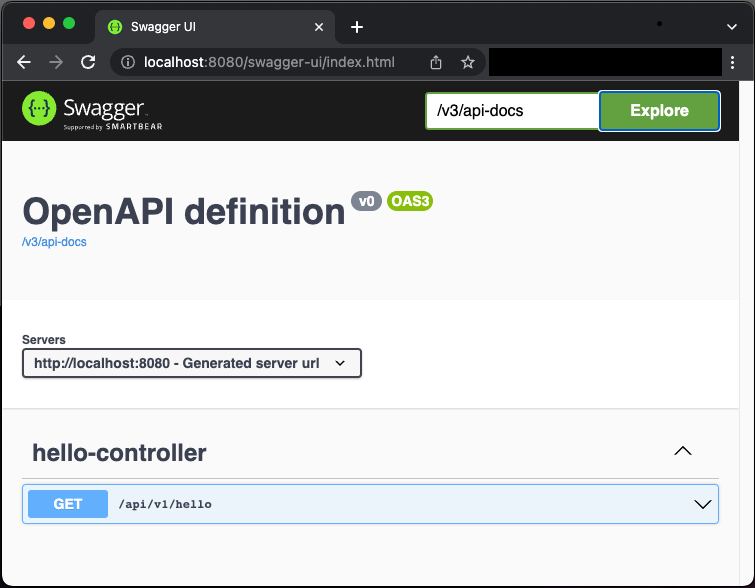

# springboot-kotlin-service

## How to build ?
Run following command from terminal.
```sh
./gradlew clean build
```

## How to run ?

### Using _bootRun_
Run following command from terminal.
```sh
./gradlew bootRun
```

### Using _java -jar_
You need to [build](#how-to-build) the project first.
```sh
java -jar build/libs/springboot-kotlin-service-0.0.1-SNAPSHOT.jar
```

## How to access API documentation ?

### Download openapi yaml documentation.
Run following command to get openapi yaml documentation.
```sh
curl curl http://localhost:8080/v3/api-docs.yaml 
```

You should see output as shown below.
```
openapi: 3.0.1
info:
  title: OpenAPI definition
  version: v0
servers:
- url: http://localhost:8080
  description: Generated server url
paths:
  /api/v1/hello:
    get:
      tags:
      - hello-controller
      operationId: hello
      parameters:
      - name: name
        in: query
        required: false
        schema:
          type: string
      responses:
        "200":
          description: OK
          content:
            '*/*':
              schema:
                type: string
components:
  schemas: {}
```

### Interact API using swagger.
Paste link below in your browser.
```
http://localhost:8080/api/v1/hello
```
You should see swagger UI as shown below.




